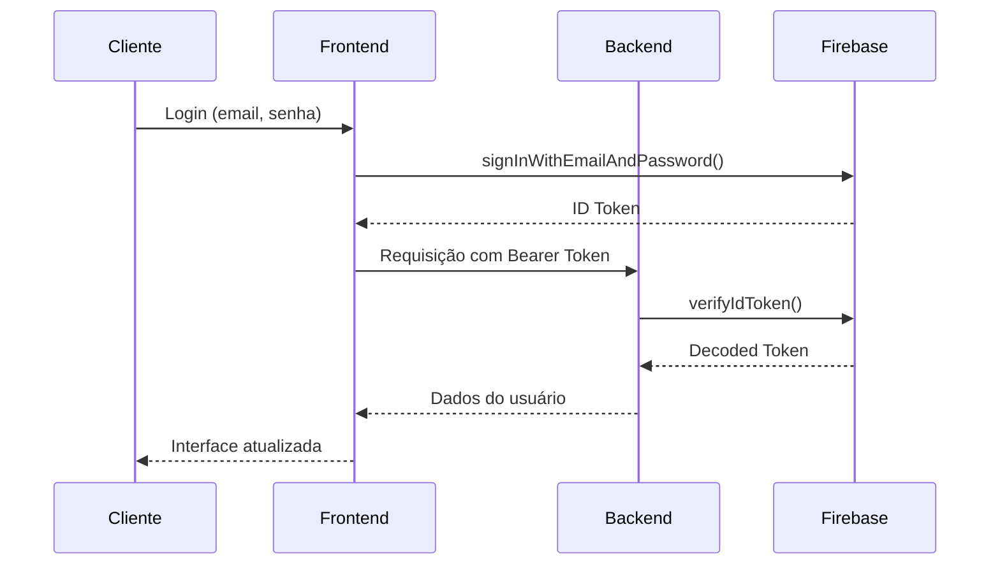

# 🔧 Documentação Técnica - Finanza Web

## 🏗️ Arquitetura Detalhada

### 📊 Diagrama de Arquitetura

```
┌─────────────────────────────────────────────────────────────────┐
│                        Cliente (Browser)                        │
├─────────────────────────────────────────────────────────────────┤
│  Frontend (HTML/CSS/JavaScript)                                 │
│  ├── Autenticação (Firebase Auth)                              │
│  ├── Interface de Usuário                                      │
│  ├── Validações Client-side                                    │
│  └── Comunicação com Backend                                   │
├─────────────────────────────────────────────────────────────────┤
│                    HTTP/HTTPS (REST API)                       │
├─────────────────────────────────────────────────────────────────┤
│  Backend (Node.js + Express)                                   │
│  ├── Middleware de Autenticação                               │
│  ├── Rotas da API                                             │
│  ├── Validações Server-side                                   │
│  └── Integração Firebase Admin                                │
├─────────────────────────────────────────────────────────────────┤
│                    Firebase Admin SDK                          │
├─────────────────────────────────────────────────────────────────┤
│  Firebase Services                                             │
│  ├── Authentication (Usuários)                                │
│  ├── Realtime Database (Dados)                                │
│  └── Security Rules                                           │
└─────────────────────────────────────────────────────────────────┘
```

### 🔄 Fluxo de Autenticação



## 🗄️ Estrutura de Dados Detalhada

### 📋 Schema do Banco de Dados

#### Coleção: `usuarios/{uid}`
```typescript
interface Usuario {
  nome: string;              // Nome completo do usuário
  email: string;             // Email de login
  saldo_total: number;       // Saldo calculado de todas as contas
  receitas_mes: number;      // Total de receitas do mês atual
  despesas_mes: number;      // Total de despesas do mês atual
  total_contas: number;      // Número de contas cadastradas
  data_criacao: timestamp;   // Data de criação da conta
  ultimo_acesso: timestamp;  // Último login
}
```

#### Coleção: `contas/{uid}/{conta_id}`
```typescript
interface Conta {
  nome: string;              // Nome da conta (ex: "Conta Corrente")
  tipo: 'corrente' | 'poupanca' | 'cartao' | 'investimento';
  saldo: number;             // Saldo atual da conta
  saldo_inicial: number;     // Saldo quando criada
  ativa: boolean;            // Se a conta está ativa
  data_criacao: timestamp;
  data_atualizacao: timestamp;
}
```

#### Coleção: `transacoes/{uid}/{transacao_id}`
```typescript
interface Transacao {
  descricao: string;         // Descrição da transação
  valor: number;             // Valor (sempre positivo)
  tipo: 'receita' | 'despesa';
  conta_id: string;          // ID da conta relacionada
  categoria_id: string;      // ID da categoria
  data: timestamp;           // Data da transação
  data_criacao: timestamp;   // Data de registro no sistema
  observacoes?: string;      // Observações adicionais
}
```

#### Coleção: `categorias/{uid}/{categoria_id}`
```typescript
interface Categoria {
  nome: string;              // Nome da categoria
  cor: string;               // Cor em hex (#FF0000)
  tipo: 'receita' | 'despesa';
  ativa: boolean;            // Se está ativa
  data_criacao: timestamp;
}
```

### 🔐 Regras de Segurança Firebase

```javascript
{
  "rules": {
    ".read": false,
    ".write": false,
    
    "usuarios": {
      "$uid": {
        ".read": "$uid === auth.uid",
        ".write": "$uid === auth.uid && auth != null",
        ".validate": "newData.hasChildren(['nome', 'email'])"
      }
    },
    
    "contas": {
      "$uid": {
        ".read": "$uid === auth.uid",
        ".write": "$uid === auth.uid && auth != null",
        "$conta_id": {
          ".validate": "newData.hasChildren(['nome', 'tipo', 'saldo'])"
        }
      }
    },
    
    "transacoes": {
      "$uid": {
        ".read": "$uid === auth.uid",
        ".write": "$uid === auth.uid && auth != null",
        "$transacao_id": {
          ".validate": "newData.hasChildren(['descricao', 'valor', 'tipo', 'conta_id', 'categoria_id', 'data'])"
        }
      }
    },
    
    "categorias": {
      "$uid": {
        ".read": "$uid === auth.uid",
        ".write": "$uid === auth.uid && auth != null",
        "$categoria_id": {
          ".validate": "newData.hasChildren(['nome', 'cor', 'tipo'])"
        }
      }
    }
  }
}
```

## 🔌 API Reference

### 🔐 Endpoints de Autenticação

#### `GET /auth/me`
Retorna dados do usuário autenticado.

**Headers:**
```
Authorization: Bearer <firebase_id_token>
```

**Response (200):**
```json
{
  "nome": "João Silva",
  "email": "joao@email.com",
  "saldo_total": 2500.50,
  "receitas_mes": 3000.00,
  "despesas_mes": 500.50,
  "total_contas": 3
}
```

#### `POST /auth/me`
Atualiza dados do usuário autenticado.

**Headers:**
```
Authorization: Bearer <firebase_id_token>
Content-Type: application/json
```

**Body:**
```json
{
  "nome": "João Silva Santos",
  "saldo_total": 2600.00,
  "receitas_mes": 3100.00,
  "despesas_mes": 500.00,
  "total_contas": 3
}
```

**Response (200):**
```json
{
  "success": true
}
```

### 📊 Endpoints de Dados

#### `GET /api/financialSummary`
Retorna resumo financeiro do usuário.

**Headers:**
```
Authorization: Bearer <firebase_id_token>
```

**Response (200):**
```json
{
  "saldo_total": 2500.50,
  "receitas_mes": 3000.00,
  "despesas_mes": 500.50,
  "total_contas": 3
}
```

## 🛠️ Configuração de Desenvolvimento

### 🔧 Ambiente Local

#### Variáveis de Ambiente
```bash
# .env (opcional)
PORT=3001
NODE_ENV=development
FIREBASE_DATABASE_URL=https://finanza-2cd68-default-rtdb.firebaseio.com
```

#### Scripts NPM
```json
{
  "scripts": {
    "start": "node server.js",
    "dev": "nodemon server.js",
    "test": "jest",
    "lint": "eslint .",
    "build": "npm run lint && npm test"
  }
}
```

### 🧪 Testes (Configuração Futura)

#### Estrutura de Testes
```
tests/
├── unit/
│   ├── auth.test.js
│   ├── api.test.js
│   └── database.test.js
├── integration/
│   ├── login.test.js
│   └── transactions.test.js
└── e2e/
    └── user-flow.test.js
```

#### Exemplo de Teste Unitário
```javascript
// tests/unit/auth.test.js
const request = require('supertest');
const app = require('../../server');

describe('Auth Endpoints', () => {
  test('GET /auth/me without token returns 401', async () => {
    const response = await request(app)
      .get('/auth/me');
    
    expect(response.status).toBe(401);
    expect(response.body.error).toBe('Token ausente.');
  });
});
```

## 🔨 Middleware Customizado

### 🔐 authRequired Middleware
```javascript
function authRequired(req, res, next) {
  const auth = req.headers.authorization;
  
  if (!auth) {
    return res.status(401).json({ error: 'Token ausente.' });
  }
  
  const token = auth.replace('Bearer ', '');
  
  admin.auth().verifyIdToken(token)
    .then(decodedToken => {
      req.user = decodedToken;
      next();
    })
    .catch(error => {
      console.error('Token verification failed:', error);
      res.status(401).json({ error: 'Token inválido ou expirado.' });
    });
}
```

### 📝 Logging Middleware
```javascript
function requestLogger(req, res, next) {
  const timestamp = new Date().toISOString();
  const method = req.method;
  const url = req.url;
  const userAgent = req.get('User-Agent');
  
  console.log(`[${timestamp}] ${method} ${url} - ${userAgent}`);
  next();
}

app.use(requestLogger);
```

### 🛡️ Security Headers Middleware
```javascript
function securityHeaders(req, res, next) {
  res.setHeader('X-Content-Type-Options', 'nosniff');
  res.setHeader('X-Frame-Options', 'DENY');
  res.setHeader('X-XSS-Protection', '1; mode=block');
  next();
}

app.use(securityHeaders);
```

## 📊 Frontend - Componentes JavaScript

### 🔄 Estado Global
```javascript
class AppState {
  constructor() {
    this.user = null;
    this.accounts = [];
    this.transactions = [];
    this.categories = [];
    this.listeners = {};
  }

  setUser(user) {
    this.user = user;
    this.notifyListeners('user', user);
  }

  subscribe(event, callback) {
    if (!this.listeners[event]) {
      this.listeners[event] = [];
    }
    this.listeners[event].push(callback);
  }

  notifyListeners(event, data) {
    if (this.listeners[event]) {
      this.listeners[event].forEach(callback => callback(data));
    }
  }
}

const appState = new AppState();
```

### 🔧 Utilitários
```javascript
// Formatação de moeda
function formatCurrency(value) {
  return new Intl.NumberFormat('pt-BR', {
    style: 'currency',
    currency: 'BRL'
  }).format(value);
}

// Formatação de data
function formatDate(date) {
  return new Intl.DateTimeFormat('pt-BR').format(new Date(date));
}

// Validação de email
function isValidEmail(email) {
  const regex = /^[^\s@]+@[^\s@]+\.[^\s@]+$/;
  return regex.test(email);
}

// Debounce para inputs
function debounce(func, wait) {
  let timeout;
  return function executedFunction(...args) {
    const later = () => {
      clearTimeout(timeout);
      func(...args);
    };
    clearTimeout(timeout);
    timeout = setTimeout(later, wait);
  };
}
```

### 📡 API Client
```javascript
class ApiClient {
  constructor(baseURL = 'http://localhost:3001') {
    this.baseURL = baseURL;
  }

  async request(endpoint, options = {}) {
    const token = localStorage.getItem('firebase_token');
    
    const config = {
      headers: {
        'Content-Type': 'application/json',
        ...(token && { Authorization: `Bearer ${token}` }),
        ...options.headers
      },
      ...options
    };

    try {
      const response = await fetch(`${this.baseURL}${endpoint}`, config);
      
      if (!response.ok) {
        throw new Error(`HTTP error! status: ${response.status}`);
      }
      
      return await response.json();
    } catch (error) {
      console.error('API request failed:', error);
      throw error;
    }
  }

  // Métodos específicos
  async getUser() {
    return this.request('/auth/me');
  }

  async updateUser(userData) {
    return this.request('/auth/me', {
      method: 'POST',
      body: JSON.stringify(userData)
    });
  }

  async getFinancialSummary() {
    return this.request('/api/financialSummary');
  }
}

const apiClient = new ApiClient();
```

## 🚀 Deploy e Produção

### 🐳 Docker (Opcional)
```dockerfile
# Dockerfile
FROM node:18-alpine

WORKDIR /app

COPY package*.json ./
RUN npm ci --only=production

COPY . .

EXPOSE 3001

USER node

CMD ["npm", "start"]
```

### ☁️ Firebase Hosting
```json
{
  "hosting": {
    "public": "public",
    "ignore": [
      "firebase.json",
      "**/.*",
      "**/node_modules/**"
    ],
    "rewrites": [
      {
        "source": "**",
        "destination": "/index.html"
      }
    ]
  }
}
```

### 🔧 PM2 (Process Manager)
```json
{
  "name": "finanza-web",
  "script": "server.js",
  "instances": "max",
  "exec_mode": "cluster",
  "env": {
    "NODE_ENV": "production",
    "PORT": 3001
  },
  "error_file": "./logs/err.log",
  "out_file": "./logs/out.log",
  "log_file": "./logs/combined.log"
}
```

## 📈 Monitoramento e Logs

### 📊 Health Check
```javascript
app.get('/health', (req, res) => {
  res.json({
    status: 'OK',
    timestamp: new Date().toISOString(),
    uptime: process.uptime(),
    memory: process.memoryUsage(),
    version: process.version
  });
});
```

### 📝 Logging Avançado
```javascript
const winston = require('winston');

const logger = winston.createLogger({
  level: 'info',
  format: winston.format.combine(
    winston.format.timestamp(),
    winston.format.json()
  ),
  transports: [
    new winston.transports.File({ filename: 'error.log', level: 'error' }),
    new winston.transports.File({ filename: 'combined.log' })
  ]
});

if (process.env.NODE_ENV !== 'production') {
  logger.add(new winston.transports.Console({
    format: winston.format.simple()
  }));
}
```

---

## 🤝 Contribuição para Desenvolvedores

### 📋 Checklist para PRs
- [ ] Código documentado
- [ ] Testes incluídos
- [ ] Lint passing
- [ ] Performance considerada
- [ ] Segurança revisada
- [ ] Compatibilidade verificada

### 🎯 Roadmap Técnico
- [ ] Implementar testes automatizados
- [ ] Adicionar TypeScript
- [ ] Melhorar performance com lazy loading
- [ ] Implementar PWA features
- [ ] Adicionar modo offline
- [ ] Melhorar acessibilidade (WCAG)

---

**Documentação técnica mantida pela equipe de desenvolvimento**